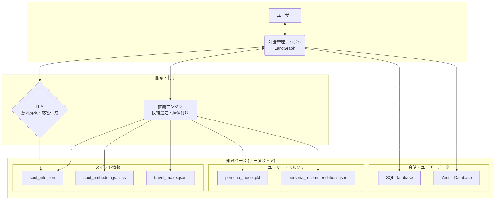
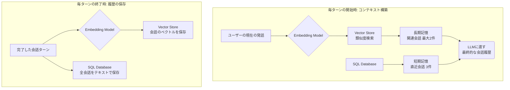

# 推薦・対話フェーズ システムアーキテクチャ定義書

## 1. 概要

本ドキュメントは、対話を通じてユーザーにパーソナライズされた鳥海山の観光スポットを推薦し、インタラクティブに「周遊計画」を構築するAIエージェントのシステムアーキテクチャを定義する。

本アーキテクチャは、多言語対応（日本語, 英語, 北京語）を前提とし、ユーザーアカウントごとに周遊計画や会話履歴をデータベースに永続化する設計を持つ。また、LLMのコンテキストウィンドウを効率的に利用するため、会話履歴圧縮メカニズムを導入する。

## 2. 推薦機能の利用に必要な要素

AIエージェントが推薦機能を利用するためには、以下の要素が必要です。

1.  **`processed/` ディレクトリ全体**:
    学習によって生成された、推薦ロジックの頭脳となる全てのデータとモデル。

2.  **`recommender.py` ファイル**:
    上記データを読み込み、実際のリクエストに対して推薦計算を実行する本番用のロジック。`recommendation_engine.py`は検証用サンプルとして参照する。

3.  **ライブラリ依存関係**:
    ライブラリ (`pandas`, `scikit-learn`, `faiss-cpu`など) がインストールされた実行環境。

## 3. システムアーキテクチャ全体像



## 4. 各コンポーネントの役割

### 4.1. 対話管理エンジン (LangGraph)
システムの中枢として、対話全体の流れと状態を管理する。

- **状態 (State) 管理**:
  - `user_name`, `language`, `user_profile`, `itinerary`, `chat_history`, `user_input`, `parsed_intent`, `recommendations`, `response_text`
  - ペルソナ分類は各ターンでユーザープロファイルを用いて再計算し、結果は推論中に利用するのみ（状態には保持しない）。

- **フロー制御 (主要ノード)**:
  - `start_session`（ユーザーデータのロード／初期化）
  - `build_context`（短期・長期記憶からチャット履歴を構築）
  - `parse_intent`（LLMで意図解析）
  - `get_recommendations`（必要に応じて推薦取得）
  - `update_itinerary`（意図に応じた旅程更新）
  - `generate_response`（応答生成）
  - `end_session`（状態保存・会話ログ persist）

### 4.2. LLM (大規模言語モデル)
人間らしい対話を実現するための言語処理を担当する。

- **意図解釈 (Intent Classification)**: ユーザーの発言を解釈し、その意図を分類する。
  - `request_recommendation`, `add_to_plan`, `delete_from_plan`, `reorder_plan`, `restart_plan`, `ask_question`, `affirmation/negation`, `chitchat`

- **情報抽出 (Entity Extraction)**: 発言からキーワードや対象スポット、順序などを抽出する。

- **応答生成 (Natural Language Generation)**: `itinerary`の自然な要約を含む、文脈に応じた応答文の組み立て。

### 4.3. 推薦エンジン
ユーザーに最適なスポットを推薦するための計算処理を専門に行う。

- **入力**: `user_profile`, `itinerary`
- **処理**: 各ターンで保持しているユーザープロファイルからペルソナ分類を再計算し、候補生成・フィルタリング・ランキングを実行。
- **出力**: 推薦すべきスポットIDのランキングリスト（スコア、理由付き）。

### 4.4. データストア

- **スポット情報 & ユーザー・ペルソナ**: (学習フェーズの成果物)
  - `spot_info.json`, `spot_embeddings.faiss`, `travel_matrix.json`, `persona_model.pkl`, `persona_recommendations.json`
  - 多言語スポット詳細Markdown: `backend/worker/data/knowledge/{language_code}/faci_spot/*.md`

- **会話・ユーザーデータ**:
  - **SQL Database**:
    - **`users` テーブル**: `user_id` (PK), `user_name` (UNIQUE), `language`, `current_itinerary` (JSON/TEXT), `user_profile` (JSON/TEXT)
    - **`conversations` テーブル**: `message_id` (PK), `session_id`, `user_id` (FK), `role`, `content`, `meta`, `timestamp`
  - **Vector Database**: 会話履歴のベクトルを保存。

### 4.5. 会話履歴管理とコンテキスト圧縮

LLMが持つコンテキストウィンドウ（一度に処理できる情報量）の制約に対応し、かつ文脈に沿った的確な応答を維持するため、本システムは「短期記憶」と「長期記憶」を組み合わせた会話履歴圧縮メカニズムを導入する。



#### プロセス詳細

##### 毎ターンの終了時: 会話の永続化
対話が1ターン完了するごとに、以下の2つの処理を並行して実行し、会話内容を永続化する。

1.  **SQLへの保存**:
    完了した会話ターン（ユーザーの発話とAIの応答）は、そのままテキストとして**SQLデータベース**（`conversations`テーブル）に時系列で記録される。これは、直近の会話を正確に再現するための「短期記憶」の元データとなる。

2.  **ベクトルストアへの保存**:
    同じ会話ターンのテキストを**Embedding Model (Ollama)** を使ってベクトル化する。生成されたベクトルと、対応する会話のIDを**ベクトルストア**に保存する。これは、後から内容の類似度で会話を検索するための「長期記憶」の元データとなる。

##### 毎ターンの開始時: コンテキストの構築
ユーザーからの新しい発話を受け取ると、LLMに応答生成を要求する前に、以下の手順でLLMに渡す会話履歴（コンテキスト）を構築する。

1.  **短期記憶の取得**:
    **SQLデータベース**から、直近3ターン分の会話履歴をそのまま取得する。

2.  **長期記憶の検索**:
    a. ユーザーの**現在の発話**をEmbedding Modelでベクトル化する。
    b. 生成されたベクトルをクエリとして**ベクトルストア**を検索し、意味的に最も類似度が高い過去の会話履歴を最大2件取得する。

3.  **最終コンテキストの結合**:
取得した「短期記憶」（3件）と「長期記憶」（最大2件）を連結し、最終的な会話履歴としてLLMに渡す。長期記憶はエンベディング類似度で抽出されたターンのみを採用するため、全履歴を送らずとも必要な文脈を確保できる。

このメカニズムにより、直前の文脈を維持しつつ、過去の重要な会話も参照できるため、コンテキストウィンドウのサイズを効率的に利用しながら、長時間の対話でも一貫性のある応答が可能となる。

## 5. 多言語対応方針

推薦ロジックと言語処理を分離。推薦エンジンは言語非依存の`spot_id`リストを返し、AIエージェントがユーザーの言語設定に応じてテキスト情報を取得し、LLMで応答を生成する。

## 6. AIエージェント主要ノードのシステムプロンプト案

### 6.1. `parse_input` ノード (意図解釈)

- **役割**: ユーザーの最新の発話から、定義済みの「意図」と関連する「エンティティ」を抽出し、JSON形式で出力する。
- **プロンプト例**:

```
あなたはユーザーの観光に関する発話を分析し、その意図とキーワードをJSON形式で抽出するアシスタントです。

以下の意図の中から最も適切なものを一つだけ選択してください:
- request_recommendation: おすすめの場所を求めている
- add_to_plan: 提案された場所を計画に追加したい
- delete_from_plan: 計画から場所を削除したい
- reorder_plan: 周遊計画内のスポットの順序を変更したい
- restart_plan: 計画をリセットしたい
- ask_question: 特定の場所について質問している
- affirmation: 肯定的な返答
- negation: 否定的な返答
- chitchat: 雑談や挨拶

発話に含まれる観光スポット名、地名、興味などのキーワードをエンティティとして抽出してください。順序変更の場合は、対象と移動先の位置も抽出してください。

---
ユーザーの発話: {user_input}
会話の履歴: {compressed_chat_history}
---

出力は以下のJSON形式でお願いします。
{
  "intent": "...",
  "entities": {
    "spot_names": ["..."],
    "keywords": ["..."],
    "reorder_info": {
        "target_spot": "...",
        "destination_spot": "...",
        "position": "before" // or "after", "first", "last"
    }
  }
}
```

### 6.2. `generate_response` ノード (応答生成)

- **役割**: 親切なツアーガイドとして、与えられた情報に基づき、ユーザーの言語で自然で魅力的な応答メッセージを生成する。一度に最大3つのスポットを提案できる。
- **プロンプト例 (複数推薦時)**:

```
あなたは鳥海エリア専門の親切なツアーガイドです。以下の情報を基に、ユーザーへの応答メッセージを言語コード「{language}」で生成してください。

# 現在の状況
ユーザーに新しい観光スポットを複数提案します。

# 現在の周遊計画
{itinerary_summary}

# 推薦スポットリスト (3件程度)

## スポット1
- スポット名: {spot_name_1}
- 推薦理由のヒント: {reason_1}
- 詳細説明:
---
{spot_markdown_content_1}
---

## スポット2
- スポット名: {spot_name_2}
- 推薦理由のヒント: {reason_2}
- 詳細説明:
---
{spot_markdown_content_2}
---

# 指示
- 上記の推薦リスト（最大3件）を基に、それぞれのスポットの魅力を比較しながら紹介してください。
- 推薦理由のヒントを自然な会話に織り交ぜてください。（例: reasonが'nearby'なら「今いる場所から近いので、次に行くのにぴったりですよ」のように）
- 応答の最後には、「どのスポットに興味がありますか？」や「これらを計画に追加しますか？」など、ユーザーの次の行動を促す質問を加えてください。
- 親しみやすく、旅行が楽しみになるような口調でお願いします。
```
