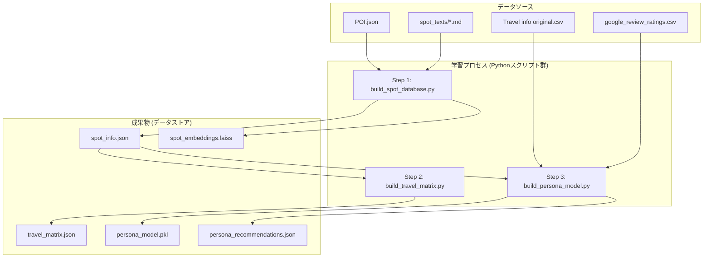

# 学習フェーズ アーキテクチャ定義書 (v3)

## 1. 概要

本ドキュメントは、`architecture_definition.md`で定義されたAIエージェントが必要とするデータストア（知識ベース）を生成するための、学習フェーズのアーキテクチャと処理フローを定義する。

## 2. 推薦エンジンの入出力スキーマ

学習フェーズで構築される推薦ロジックは、対話エンジンから以下の形式でデータを受け取り、結果を返すことを想定する。

### 入力 (Input)
```json
{
  "user_profile": {
    "age": 35,
    "travel_style": "Solo traveler",
    "interests": ["Nature/forests", "Mountains"]
  },
  "itinerary": ["spot_012", "spot_008"],
  "positive_keywords": ["滝", "静か"],
  "negative_keywords": ["混雑", "子供向け"]
}
```

### 出力 (Output)
```json
[
  {
    "spot_id": "spot_007",
    "score": 0.85,
    "reason": "persona_match" 
  },
  {
    "spot_id": "spot_009",
    "score": 0.78,
    "reason": "nearby"
  }
]
```

## 3. 学習アーキテクチャ（処理フロー）

学習フェーズは、データソースから5つの成果物ファイルを生成する3つの主要なステップで構成される。



### Step 1: `build_spot_database.py`
- **目的**: スポットに関する静的情報と意味的ベクトルを格納したデータベースを構築する。
- **処理**:
    1. `data/POI.json` と `data/spot_texts/ja/*.md` を読み込む。
    2. 両者をマージし、スポットごとの全情報（名称, カテゴリ, タグ, 詳細説明, 座標など）をまとめたデータ構造を作成する。
    3. 作成したデータ構造を **`spot_info.json`** として保存する。
    4. 各スポットの説明文をEmbedding API (`qwen3-embedding`) を用いてベクトル化する。
    5. 得られたベクトルと`spot_id`を紐づけてFaissインデックスを構築し、**`spot_embeddings.faiss`** として保存する。

### Step 2: `build_travel_matrix.py`
- **目的**: スポット間の移動コスト（時間）を計算し、効率的な周遊ルート提案の基礎データを作成する。
- **処理**:
    1. `spot_info.json` を読み込み、全スポットの座標を取得する。
    2. 各スポットのペアについて、座標間の**直線距離をHaversine formula等で計算**する。
    3. 距離を平均時速（例: 30km/h）で割り、移動分数を概算する。
    4. 計算結果を `{"spot_A": {"spot_B": {"minutes": 30}}}` の形式で **`travel_matrix.json`** として保存する。

### Step 3: `build_persona_model.py`
- **目的**: ユーザーをペルソナに分類するモデルと、各ペルソナへの初期推薦リストを、機械学習を用いて構築する。
- **機械学習処理**:
    1. **ペルソナ分類モデルの構築**: `data/raw/Travel info original.csv` のユーザー属性データを前処理し、**K-means法**でクラスタリングを実行。学習済みモデルを **`persona_model.pkl`** として保存する。
    2. **推薦リストの作成（協調フィルタリング）**:
        a. **カテゴリの再定義**: `POI.json`の`tags`（例:「滝」「神社」）を推薦システムの正式なカテゴリとして採用する。
        b. **疑似評価データの生成**: `Travel info original.csv`のユーザーの好みと`google_review_ratings.csv`の評価傾向を分析し、「このユーザーは、どのタグ（カテゴリ）を好みそうか」という疑似的な評価行列（ユーザー × タグ）を生成する。
        c. **行列分解**: 生成した疑似評価行列に対し、**行列分解（Matrix Factorization）**を適用してモデルを学習させる。これにより、ユーザーとタグの潜在的な好みを捉える。
        d. **推薦リストの生成**: 学習済みモデルを使い、Step1で分類した各ペルソナが各タグ（カテゴリ）を好む予測スコアを算出。スコアが高いタグを持つスポットを抽出し、**`persona_recommendations.json`** として保存する。

## 4. 成果物一覧

学習フェーズ全体を通して、以下の5つのファイルが生成される。

1. **`spot_info.json`**: 全スポットの静的情報DB。
2. **`spot_embeddings.faiss`**: スポットのベクトルDB。
3. **`travel_matrix.json`**: スポット間の移動時間・距離マトリクス。
4. **`persona_model.pkl`**: ユーザー分類用の学習済みモデル。
5. **`persona_recommendations.json`**: ペルソナごとの推薦リスト（機械学習により生成）。

## 5. AIエージェント主要ノードのシステムプロンプト案

### 5.1. `parse_input` ノード (意図解釈)

- **役割**: ユーザーの最新の発話から、定義済みの「意図」と関連する「エンティティ（キーワード）」を抽出し、JSON形式で出力する。
- **プロンプト例**:

```
あなたはユーザーの観光に関する発話を分析し、その意図とキーワードをJSON形式で抽出するアシスタントです。

以下の意図の中から最も適切なものを一つだけ選択してください:
- request_recommendation: おすすめの場所を求めている
- add_to_plan: 提案された場所を計画に追加したい
- delete_from_plan: 計画から場所を削除したい
- restart_plan: 計画をリセットしたい
- ask_question: 特定の場所について質問している
- affirmation: 肯定的な返答 (はい、OK)
- negation: 否定的な返答 (いいえ、違う)
- chitchat: 雑談や挨拶

発話に含まれる観光スポット名、地名、興味（例: 自然, 歴史, 温泉）などのキーワードをエンティティとして抽出してください。

---
ユーザーの発話: {user_input}
会話の履歴: {compressed_chat_history}
---

出力は以下のJSON形式でお願いします。
{
  "intent": "...",
  "entities": ["...", "..."]
}
```

### 5.2. `generate_response` ノード (応答生成)

- **役割**: 親切なツアーガイドとして、与えられた情報に基づき、ユーザーの言語で自然で魅力的な応答メッセージを生成する。
- **プロンプト例 (推薦時)**:

```
あなたは鳥海エリア専門の親切なツアーガイドです。以下の情報を基に、ユーザーへの応答メッセージを言語コード「{language}」で生成してください。

# 現在の状況
ユーザーに新しい観光スポットを提案します。

# 現在の周遊計画
{itinerary_summary}

# 推薦スポット情報
- スポット名: {spot_name}
- 推薦理由のヒント: {reason}  // persona_match, nearby, content_matchなど
- 詳細説明:
---
{spot_markdown_content}
---

# 指示
- 上記の情報をすべて踏まえ、推薦理由のヒントを自然な会話に織り交ぜながら、このスポットの魅力を伝えてください。（例: reasonが'nearby'なら「今いる場所から近いので、次に行くのにぴったりですよ」のように）
- 応答の最後には、「このスポットを計画に追加しますか？」や「他に興味のある場所はありますか？」など、ユーザーの次の行動を促す質問を加えてください。
- 親しみやすく、旅行が楽しみになるような口調でお願いします。
```